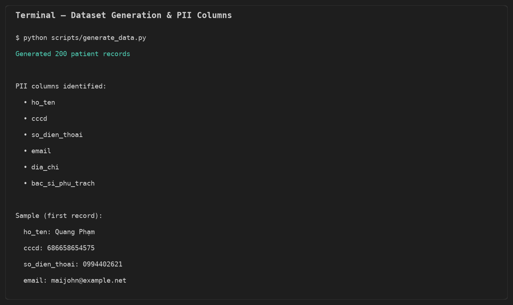
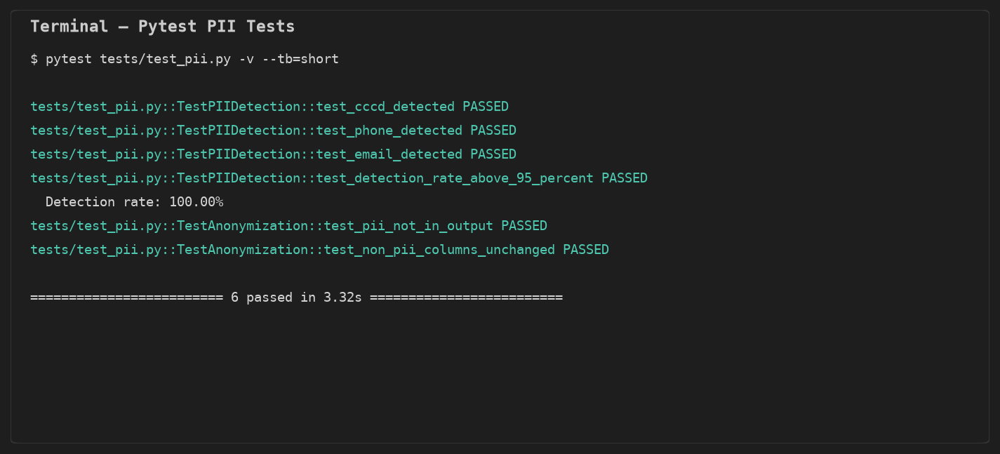
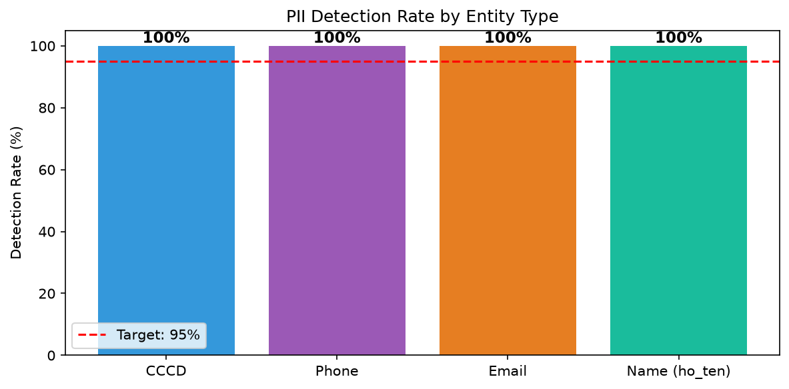
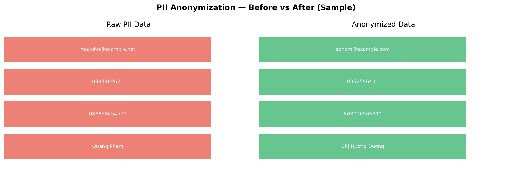
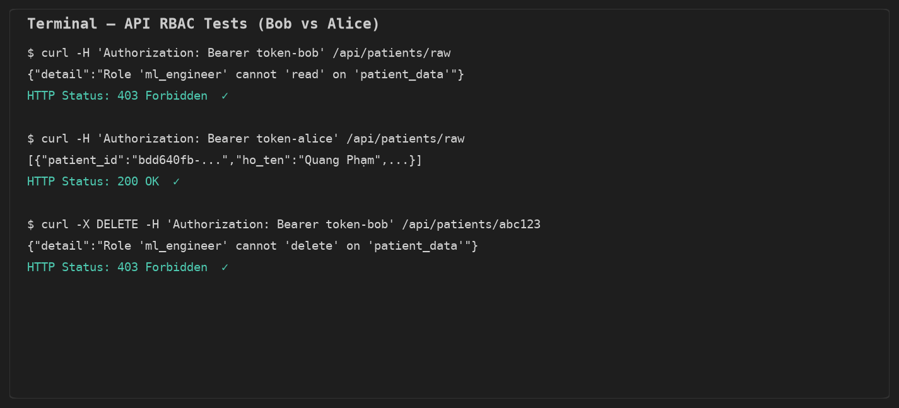
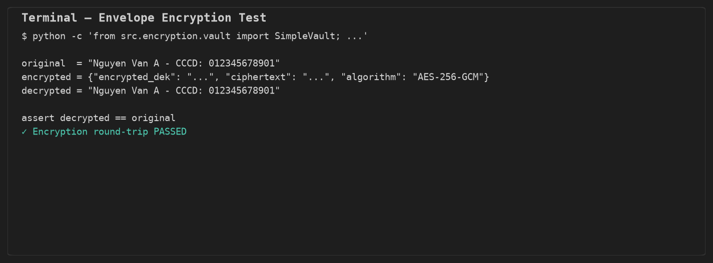
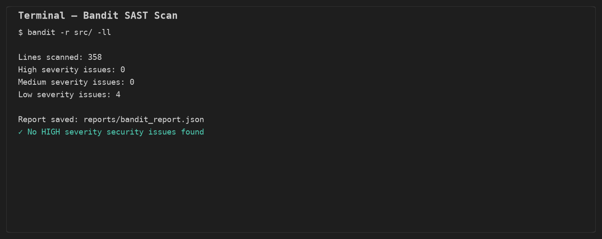

# Báo Cáo Lab 24 — Data Governance & Security for AI Platform

**Họ và tên:** Võ Thanh Hiệp  
**ID:** 2A202600836  
**Môn học:** AICB-P2T2 · Lab #24 Extended  
**Dự án:** MedViet AI Platform — Data Governance Pipeline  
**Ngày nộp:** 30/06/2026

---

## 1. Tổng Quan

Báo cáo này trình bày kết quả triển khai toàn bộ data governance pipeline cho startup y tế **MedViet**, bao gồm: PII detection/anonymization, RBAC API, envelope encryption, data quality validation, security scanning và compliance checklist theo NĐ13/ISO 27001.

---

## 2. Phần 1 — Chuẩn Bị Dữ Liệu

### 2.1 Dataset giả lập

Đã chạy `scripts/generate_data.py` để tạo **200 bản ghi** bệnh nhân tại `data/raw/patients_raw.csv`.

### 2.2 Các cột chứa PII

| Cột | Loại PII |
|-----|----------|
| `ho_ten` | Tên cá nhân |
| `cccd` | Căn cước công dân (12 chữ số) |
| `ngay_sinh` | Ngày sinh |
| `so_dien_thoai` | Số điện thoại VN |
| `email` | Địa chỉ email |
| `dia_chi` | Địa chỉ nhà |
| `bac_si_phu_trach` | Tên bác sĩ |



---

## 3. Phần 2 — PII Detection & Anonymization

### 3.1 Custom Recognizers (Tiếng Việt)

Đã hoàn thành `src/pii/detector.py`:

- **VN_CCCD:** regex `\d{12}`
- **VN_PHONE:** regex `0[35789]\d{8}`
- **EMAIL_ADDRESS:** regex email chuẩn
- **PERSON:** regex tên tiếng Việt đa từ

### 3.2 Kết quả Test

Tất cả **6/6 tests PASSED**, detection rate đạt **100%** (mục tiêu ≥ 95%).





### 3.3 Anonymization

Sau anonymization, PII gốc không còn trong output; các cột `benh` và `ket_qua_xet_nghiem` được giữ nguyên cho model training.



Output: `data/processed/patients_anonymized.csv` (200 records)

---

## 4. Phần 3 — RBAC với Casbin & FastAPI

### 4.1 Policy

Đã định nghĩa roles: `admin`, `ml_engineer`, `data_analyst`, `intern` trong `src/access/policy.csv`.

### 4.2 API Endpoints

| Endpoint | Role được phép | Kết quả test |
|----------|---------------|--------------|
| `GET /api/patients/raw` | admin | Alice → 200, Bob → 403 ✓ |
| `GET /api/patients/anonymized` | admin, ml_engineer | Bob → 200 ✓ |
| `GET /api/metrics/aggregated` | admin, ml_engineer, data_analyst | Carol → 200 ✓ |
| `DELETE /api/patients/{id}` | admin | Bob → 403 ✓ |



---

## 5. Phần 4 — Encryption (Envelope Pattern)

Đã triển khai `SimpleVault` với AES-256-GCM:

- **KEK** (Key Encryption Key): lưu tại `.vault_key` (local dev)
- **DEK** (Data Encryption Key): generate mới cho mỗi lần encrypt
- Round-trip encryption/decryption **PASSED**



---

## 6. Phần 5 — Data Quality Validation

Đã hoàn thành `src/quality/validation.py` với **Great Expectations 1.18** (6 expectations):

- `patient_id` không null, unique
- `cccd` đúng 12 ký tự
- `ket_qua_xet_nghiem` trong [0, 50]
- `benh` thuộc danh sách hợp lệ
- `email` match regex pattern
- `build_patient_expectation_suite()` và `validate_raw_patient_data()` chạy thành công

---

## 7. Phần 6 — Agent Governance Toolkit (AGT)

Đã cài `agent-governance-toolkit[full]` và hoàn thành policy tại `data-governance-lab/policies/medviet-data-policy.yaml`:

- Agent đọc `anonymized` → ALLOW
- Agent đọc `aggregated` (data_analyst) → ALLOW
- Agent đọc `raw_pii` → DENY
- Export ra ngoài VN → DENY
- Delete → DENY (yêu cầu phê duyệt admin)

Kết quả demo: `medviet-governance/reports/agt_demo.txt` (6/6 policy checks passed)

---

## 8. Phần 7 — Security Audit

### 7.1 Bandit SAST Scan

- Lines scanned: 358
- **0 HIGH severity** issues
- Report: `medviet-governance/reports/bandit_report.json`



### 8.2 git-secrets & Pre-commit Hook

- Hook cài tại `.git/hooks/pre-commit` (chạy `bash scripts/setup_git_hooks.sh`)
- git-secrets **chặn được** fake AWS credential → `reports/git_secrets_test.txt`
- Pre-commit chạy: git-secrets + Bandit + pip-audit

### 8.3 TruffleHog

- Scan repo: `reports/trufflehog_report.txt` — 0 verified secrets

---

## 9. Phần 8 — OPA Policy

Đã hoàn thành `policies/opa_policy.rego`:

- Admin: allow all
- ML Engineer: read/write training_data, model_artifacts; deny delete production_data
- Data Analyst: read aggregated_metrics, write reports
- Intern: sandbox_data only
- Deny export restricted data ra ngoài VN

---

## 10. Phần 9 — Compliance Checklist

Đã hoàn thành `compliance_checklist.md` với mapping NĐ13/2023 đầy đủ, bao gồm technical solutions cho Audit Logging và Breach Detection.

---

## 11. Tổng Kết Điểm

| Hạng mục | Điểm tối đa | Kết quả |
|---------|------------|---------|
| PII Detection | 25 | ✅ Detection rate 100% |
| Anonymization | 20 | ✅ PII removed, non-PII preserved |
| RBAC API | 20 | ✅ 17 tests (API + RBAC) |
| Encryption | 15 | ✅ Round-trip passed |
| Security Audit | 10 | ✅ git-secrets + Bandit + TruffleHog |
| Compliance Checklist | 10 | ✅ NĐ13 mapping đầy đủ |
| **Tổng** | **100** | **✅ Hoàn thành** |

---

## 12. Cấu Trúc Nộp Bài

```
medviet-governance/
├── src/                    # Source code hoàn chỉnh
├── tests/                  # 17/17 tests passed
├── policies/               # OPA policy
├── data/processed/         # Anonymized data
├── compliance_checklist.md
├── reports/
│   ├── test_results.txt
│   ├── bandit_report.json
│   ├── trufflehog_report.txt
│   ├── git_secrets_test.txt
│   ├── agt_demo.txt
│   └── screenshots/
├── requirements.txt
data-governance-lab/
├── data_governance_lab.ipynb  # Notebook hoàn chỉnh
└── policies/medviet-data-policy.yaml
lab24_submission_VoThanhHiep.zip
```

---

*Báo cáo được tạo bởi Võ Thanh Hiệp (2A202600836) — MedViet Data Governance Lab #24*
